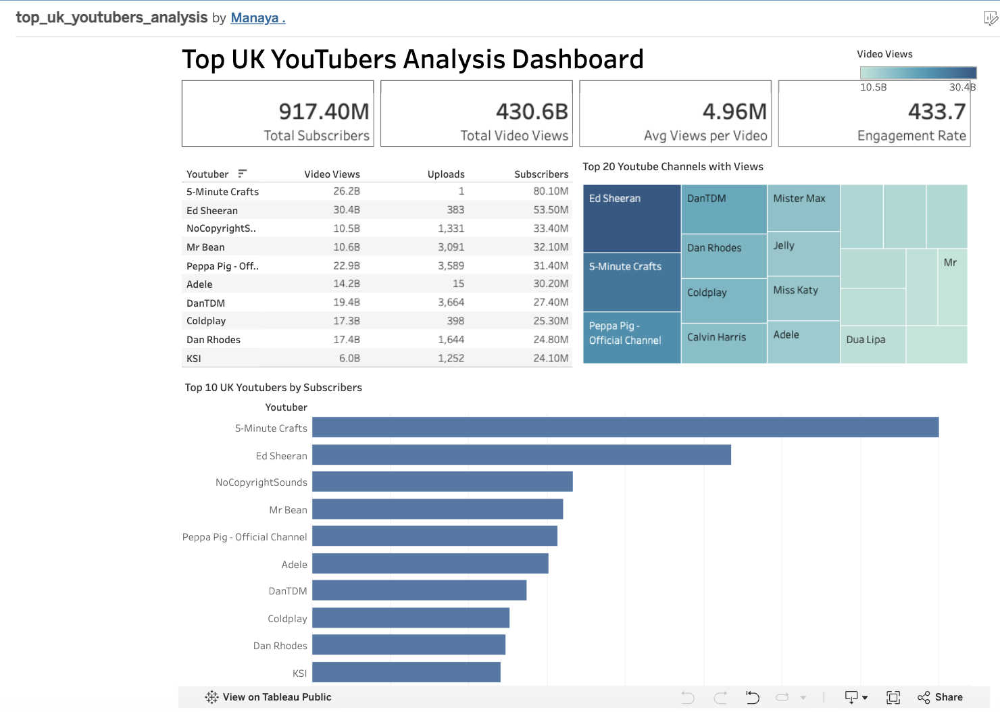

# 📊 Top UK YouTubers Tableau Dashboard

Interactive Tableau dashboard analyzing the performance of top UK YouTube channels.

## 🔍 Project Overview

The project walks through a real-world dataset containing information like
- Channel Name
- Subscribers Count
- Video Views
- Genre / Category
- Country (UK)
- Estimated Earnings

We apply Python libraries like pandas, matplotlib, and seaborn to analyze trends, compare performance, and visualize relationships.

## 📂 Dataset

The project uses a global YouTube dataset and a cleaned UK-specific dataset.
## Raw Dataset
The original dataset contains YouTube channel information from multiple countries.
## Cleaned Dataset
The raw data was cleaned using Python and filtered to retain UK YouTube channels.


## 🛠️ Tools & Technologies

- **Python** — Data cleaning and exploratory data analysis
- **Pandas** — Data manipulation
- **Matplotlib & Seaborn** — Data visualization
- **SQLite / SQL** — Analytical queries
- **Tableau Public** — Interactive dashboard


## 📊 Dashboard Preview



## 🔗 Tableau Public Dashboard

[View the Interactive Tableau Dashboard](https://public.tableau.com/app/profile/manaya.4915/viz/top_uk_youtubers_analysis/Dashboard2?publish=yes)


 ## 📁 Project Structure
```
Top-UK-YouTubers-Tableau-Dashboard/
│
├── assets/
│   ├── datasets/
│   │   ├── global_youtube_dataset.csv
│   │   └── top_uk_youtubers_cleaned.csv
│   │
│   └── images/
│       └── tableau_dashboard.png
│
├── Top_UK_YouTubers_2024.ipynb
│
└── README.md
```

